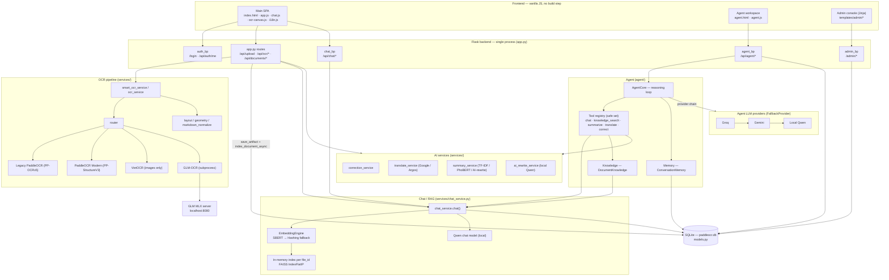
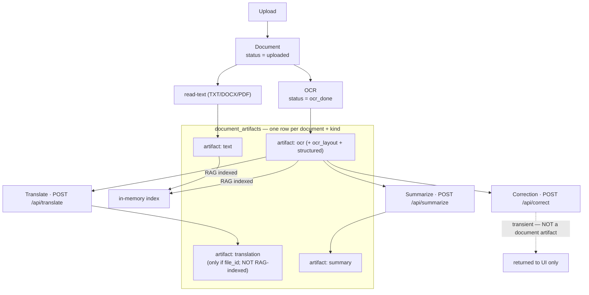
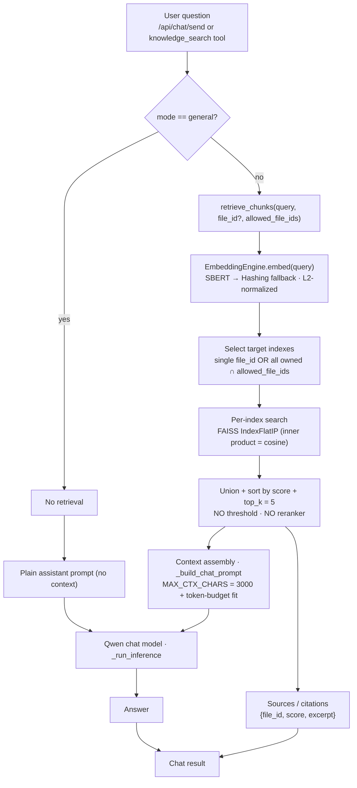
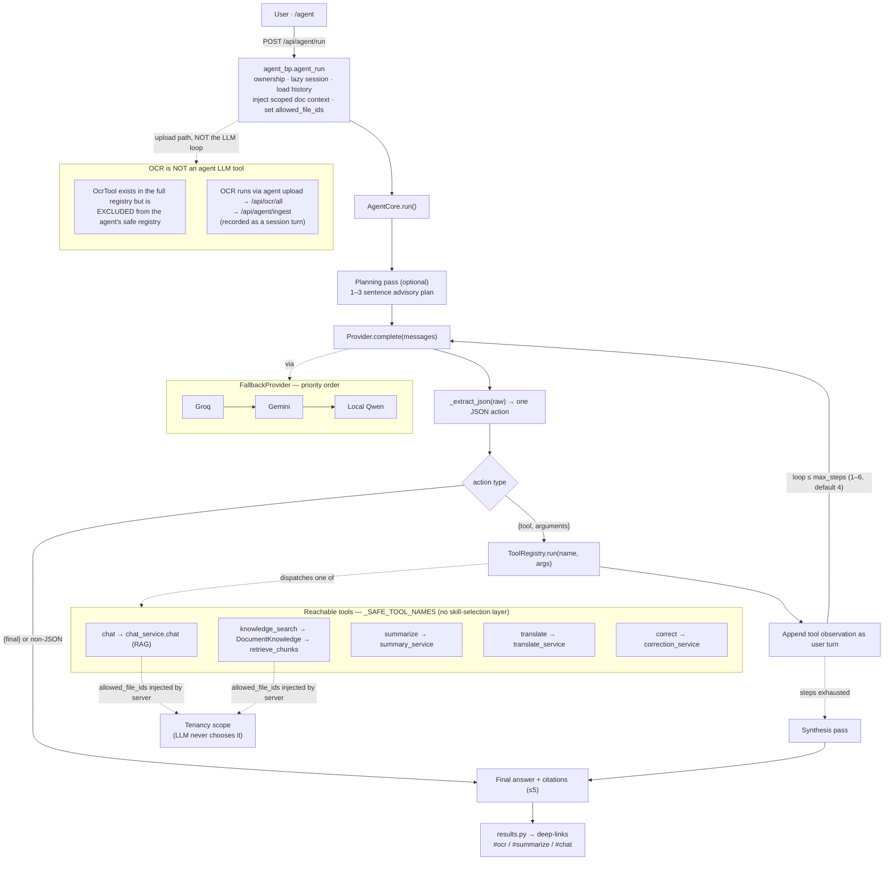
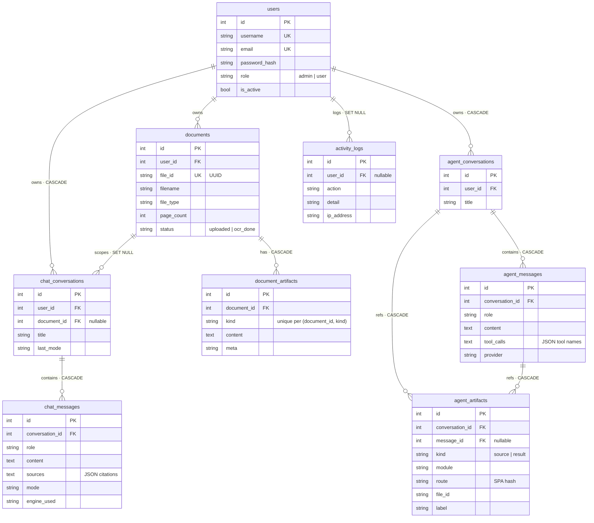
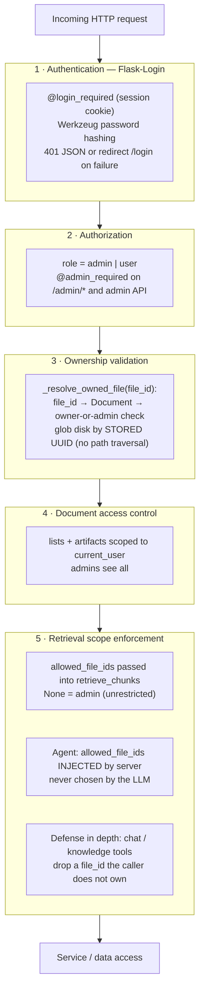
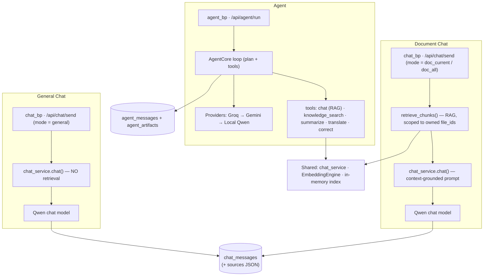

# SmartDocs-Agent — Architecture Diagrams

> Mermaid diagrams reflecting the **current implementation** as documented in [ARCHITECTURE.md](./ARCHITECTURE.md). These are not idealized designs — each diagram maps to code that exists today. Notably: the agent has **no skill-selection layer** (skills are implemented but disabled in the live HTTP loop), the `ocr` tool is **excluded** from the agent's reachable toolset, RAG uses **no score threshold and no reranker**, and `/api/correct` output is **not persisted** as a document artifact.

---

## 1. Overall System Architecture

**Explanation.** A single-process Flask monolith serves two front ends (the main hash-routed SPA and a standalone `/agent` page) plus a Jinja admin console. Four blueprints route to in-process service modules. The only out-of-process dependency is GLM-OCR, which runs as a subprocess that talks to a local MLX server on `:8080`. The agent reuses the same OCR/AI/RAG services through tools rather than duplicating them, and all state persists to one SQLite database.

---

## 2. OCR Processing Pipeline

```mermaid
flowchart LR
  UP["POST /api/upload<br/>UUID filename · extension allowlist"] --> DOC["Document row<br/>status = uploaded"]
  DOC --> REQ["POST /api/ocr/all or /api/ocr/page"]
  REQ --> OWN["_resolve_owned_file<br/>ownership / IDOR guard"]
  OWN --> ENG["Engine OCR via router<br/>Legacy / Modern / VietOCR / GLM"]
  ENG --> NAT{"layout_native?"}
  NAT -->|"no (Legacy, VietOCR)"| GEO["geometry / layout<br/>reading-order reconstruction"]
  NAT -->|"yes (Modern, GLM)"| AIQ
  GEO --> AIQ{"apply_ai?"}
  AIQ -->|"yes"| CLEAN["Qwen line cleanup<br/>(smart mode, safety-gated; text only)"]
  AIQ -->|"no"| STORE
  CLEAN --> STORE["save_artifact<br/>ocr · ocr_layout · ocr_markdown/html/tables/blocks/json/images"]
  STORE --> IDX["index_document_async<br/>(canonical 'ocr' text)"]
  IDX --> RIDX["In-memory RAG index"]
  STORE --> LIB["Document Library<br/>GET /api/documents (artifact_kinds badges)"]
```

**Explanation.** Upload stores the file under a server-generated UUID and creates a `Document`. OCR runs through the engine router; only engines that are **not** `layout_native` get geometric re-ordering. The optional "smart" AI pass corrects recognized text lines but never alters boxes/structure. Results upsert into `document_artifacts` (one row per kind), the canonical text is asynchronously indexed for RAG, and the Document Library surfaces which artifact kinds exist.

---

## 3. Document Lifecycle

**Explanation.** A document accumulates persisted artifacts keyed by `(document_id, kind)`. OCR and read-text outputs are both RAG-indexed. Translation persists only when a `file_id` is supplied and is **not** indexed; summary persists. **Correction is a transient text transform** — it returns to the UI but has no `document_artifacts` kind, so it is never stored.

---

## 4. RAG Architecture

**Explanation.** Retrieval is skipped entirely in `general` mode. Otherwise the query is embedded, the candidate index set is scoped by `allowed_file_ids` (tenancy), each index is searched via inner-product over L2-normalized vectors (cosine), and the union is sorted and truncated to `top_k = 5` — with **no similarity threshold and no second-stage reranking**. The fitted context drives the local Qwen model; sources are derived directly from the retrieved chunks.

---

## 5. Agent Architecture *(current implementation — tool orchestration, no skill layer)*

**Explanation.** `AgentCore` runs an iterative ReAct-style loop: an optional advisory planning call, then up to `max_steps` cycles of *LLM completion → parse one JSON action → dispatch a tool → feed the observation back*, ending on a `{final}` action or a synthesis pass once steps are exhausted. There is **no skill-selection layer** — skills exist in code but the live agent is built with an empty skill registry, so it orchestrates the five safe tools directly. The path-based **`ocr` tool is deliberately excluded** from the agent's reach; OCR happens through the upload/ingest flow instead. `allowed_file_ids` is injected by the server for the `chat` and `knowledge_search` tools, so the model can never widen its own data scope. Each completion goes through the Groq→Gemini→Local-Qwen fallback chain.

---

## 6. Database ER Diagram

**Explanation.** Nine tables, confirmed against the live schema. Documents own cascade-deleting `document_artifacts` (with a unique `(document_id, kind)` constraint). Chat and agent conversations are independent message trees. **There is no citations table**: chat citations live as JSON in `chat_messages.sources`, and `agent_artifacts` holds lightweight *references* (module + SPA route + label) back into the real artifacts. ORM-level cascades are the reliable delete path (DB-level `ON DELETE` only fires if SQLite `PRAGMA foreign_keys=ON`).

---

## 7. Security Architecture

**Explanation.** Every request passes through layered gates. Authentication is session-based; authorization is a simple `role` check. Ownership is enforced by resolving a `file_id` to an owned `Document` and globbing disk only by the **server-stored UUID**, which closes IDOR and path-traversal. Listings and retrieval are scoped to the caller's documents, and the agent path injects the allowed scope server-side (the model cannot pick `file_id`s), with tool-level guards as a backstop.

---

## 8. Chat Modes Architecture

**Explanation.** Three distinct surfaces share infrastructure but differ in behavior and persistence. **General Chat** does no retrieval and answers from the local Qwen model alone. **Document Chat** adds scoped RAG retrieval before the same local model and stores citations as JSON on the message. **Agent** is the only orchestrating surface — it runs through the multi-provider fallback chain and can invoke multiple tools (its `chat` tool itself reuses the Document-Chat RAG path), persisting turns and lightweight artifact references to the separate `agent_*` tables.
