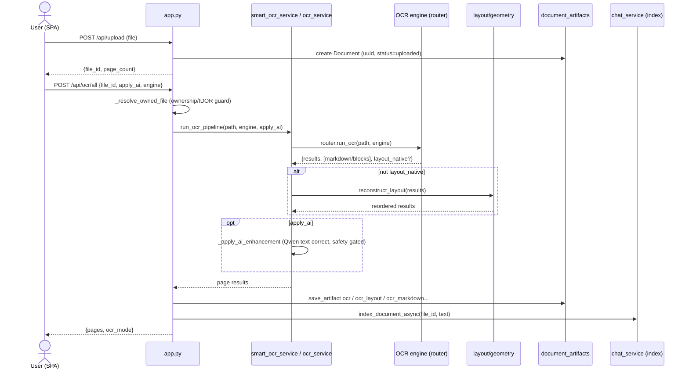
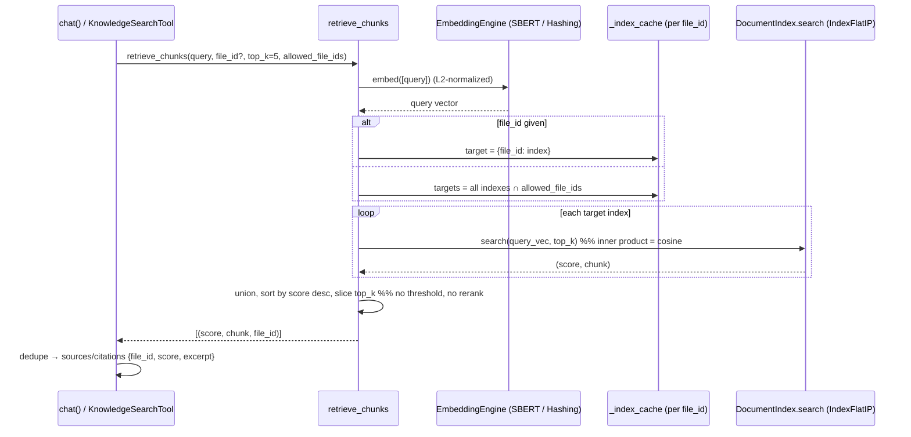

# SmartDocs-Agent — Technical Architecture

**Audit date:** 2026-06-19 · **App version:** `2026.06.14.1` ([app.py:43](../app.py#L43))

> **Scope & method.** This document describes **only the architecture that currently exists in source**. Planned, deprecated, and removed features are excluded. Every major statement is traceable to a file and line. All paths are relative to the `SmartDocs-Agent/` repository root. Claims are **source-grounded** (read from code) but, except where noted, **not execution-verified** — no app run, build, or `pytest` was performed for this audit. Genuinely uncertain items are marked **UNKNOWN**.

---

## 1. Executive Summary

### Purpose

SmartDocs-Agent is an offline-first, document-centric AI platform built around a Flask monolith. It is the agent-oriented successor to the SmartDocs OCR application, developed additively in a parallel directory ([CLAUDE.md](../CLAUDE.md)). Its design intent is that document capabilities — OCR, correction, translation, summarization, retrieval/chat — are exposed as **tools** behind an **agent orchestration layer**, while remaining individually usable through their own UI views and API endpoints.

### Core capabilities (all present in code)

- **OCR** across four engines (Legacy PaddleOCR, PaddleOCR Modern / PP-StructureV3, VietOCR, GLM-OCR) with an artifact-driven 4-tab viewer.
- **Text correction** (classical rule-based + spell-check).
- **Translation** (online Google Translate / offline Argos neural MT).
- **Summarization** (extractive TF-IDF/TextRank and PhoBERT-embedding engines, plus an optional Qwen abstractive "AI rewrite").
- **RAG chat** over indexed documents (single-doc, all-docs, or general modes) with citations.
- **An LLM agent** that plans and chains the above tools, with durable sessions, document scoping, and deep-links back into the standard viewers.
- **User management & admin** (auth, roles, activity logging, file oversight).

### High-level architecture

```
Browser (vanilla-JS SPA + standalone /agent page)
        │  HTTP/JSON (cookie session)
        ▼
Flask app (app.py) ── blueprints: auth, admin, chat, agent
        │
        ├── services/        OCR engines, AI services (correction/translate/summary/rewrite/chat-RAG)
        ├── agent/           AgentCore, providers, tools, skills, knowledge, memory
        ├── models.py        SQLAlchemy ORM (SQLite: paddleocr.db)
        └── uploads/         user files (UUID-named) + in-memory RAG index
```

The system is a **single-process Python monolith**. There is no microservice split; "services" are in-process Python modules. The only out-of-process dependency is the **GLM-OCR subprocess** (its own venv + a local MLX model server on `:8080`).

---

## 2. System Architecture

### Frontend architecture

Vanilla JavaScript, **no framework and no build step**. There is no `package.json`, bundler, or `node_modules` in the project; the `npm run build` mentioned in the parent OCRSoftware `CLAUDE.md` does not apply here. Third-party libraries (`marked`, `katex`) are vendored as static files under [static/vendor/](../static/vendor/). Cache-busting is manual via `?v=YYYY.MM.DD.N` query strings ([static/index.html:7-10](../static/index.html#L7-L10)).

Two HTML shells plus Jinja templates:
- **Main SPA** — [static/index.html](../static/index.html) served at `/` ([app.py:161-164](../app.py#L161-L164)); a hash-routed single-page app ([static/app.js](../static/app.js)) with seven views, layered with [static/chat.js](../static/chat.js).
- **Agent workspace** — [static/agent.html](../static/agent.html) served at `/agent` ([agent_bp.py:771-774](../agent_bp.py#L771-L774)); a standalone page driven by [static/agent.js](../static/agent.js). It does **not** load app.js/chat.js/i18n.js.
- **Server-rendered Jinja** — login ([templates/login.html](../templates/login.html)), 403 ([templates/403.html](../templates/403.html)), and the admin console ([templates/admin/](../templates/admin/)).

### Backend architecture

A global Flask app (not an app factory) created at [app.py:23](../app.py#L23), with config copied onto `app.config` ([app.py:24-43](../app.py#L24-L43)). Extensions: **Flask-SQLAlchemy** (`db.init_app`, [app.py:58](../app.py#L58)) and **Flask-Login** ([app.py:59-64](../app.py#L59-L64)). Four blueprints are registered ([app.py:81-84](../app.py#L81-L84)):

| Blueprint | Prefix | Source |
|---|---|---|
| `auth_bp` | (root) | [auth.py:8](../auth.py#L8) |
| `admin_bp` | `/admin` | [admin_bp.py:9](../admin_bp.py#L9) |
| `chat_bp` | (root; routes hardcode `/api/chat/...`) | [chat_bp.py:25](../chat_bp.py#L25) |
| `agent_bp` | (root; routes hardcode `/api/agent/...`, `/agent`) | [agent_bp.py:45](../agent_bp.py#L45) |

### Service boundaries

- **`app.py`** — OCR/upload/document HTTP endpoints + cross-cutting helpers (ownership resolution, artifact persistence).
- **`services/`** — pure in-process capability modules: OCR engines and pipeline; AI services (correction, translation, summarization, AI-rewrite, RAG chat); shared infrastructure (`llm_registry`, `cpu_threads`, `activity_registry`).
- **`agent/`** — the agent layer: `core` (AgentCore + LLM providers), `tools`, `skills`, `knowledge`, `memory`, plus `ocr_routing.py` and `results.py`. The agent **reuses the services through tools** rather than duplicating logic.
- **`models.py`** — the ORM and all DB helper functions.

### Request lifecycle

1. **Auth gate.** Almost every route is `@login_required` (Flask-Login). Unauthenticated `/api/*` or JSON requests get a 401 JSON `{redirect:"/login"}`; HTML requests redirect to login ([app.py:66-70](../app.py#L66-L70)).
2. **Body-size cap.** `MAX_CONTENT_LENGTH` from config; oversize uploads raise `RequestEntityTooLarge` → 413 JSON ([app.py:75-79](../app.py#L75-L79)).
3. **Handler executes** (in a blueprint or `app.py`), typically resolving ownership for any `file_id`/`doc_id`, calling a service, persisting artifacts, and returning JSON.
4. **`after_request`** — `_no_cache_static` sets no-cache headers for `/`, `/static/`, and HTML/JS/CSS; API JSON is untouched ([app.py:45-56](../app.py#L45-L56)). This is the **only** request hook — there are **no `before_request`/`teardown` hooks**.

There is **no CSRF protection**, no CORS layer, and no rate limiter. The only CSRF mitigation is `SameSite=Lax` on the session/remember cookies ([app.py:33-38](../app.py#L33-L38)).

---

## 3. Functional Modules

### OCR module
Upload → engine OCR → (optional geometric reorder / AI text-correction) → persist artifacts → viewer. Endpoints `/api/upload`, `/api/ocr/page`, `/api/ocr/all`, `/api/ocr/reconstruct-region`, `/api/read-text` ([app.py:168-645](../app.py#L168-L645)). Detailed in §4.

### Correction module
[services/correction_service.py](../services/correction_service.py) `correct(text)` ([correction_service.py:36-60](../services/correction_service.py#L36-L60)) — **classical, not LLM**: regex normalization (`_basic_clean`, [:22-34](../services/correction_service.py#L22-L34)) + optional English-only `autocorrect.Speller` ([:11-20](../services/correction_service.py#L11-L20)). Returns `{corrected, changes, elapsed_ms}`. Exposed at `POST /api/correct` ([app.py:646](../app.py#L646)).

### Translation module
[services/translate_service.py](../services/translate_service.py) `translate(text, from_lang="auto", to_lang="vi", engine="auto")` ([:269-279](../services/translate_service.py#L269-L279)). **Online** = Google Translate via `deep_translator` ([:137-146](../services/translate_service.py#L137-L146)); **offline** = Argos Translate / CTranslate2 ([:159-190](../services/translate_service.py#L159-L190)). `auto` picks online if reachable, else offline, with **no mid-execution fallback** ([:315-324](../services/translate_service.py#L315-L324)). Stanza (an Argos dependency) is aggressively monkey-patched offline ([:36-98](../services/translate_service.py#L36-L98)). Endpoints `/api/translate`, `/api/translate/status`.

### Summarization module
[services/summary_service.py](../services/summary_service.py) `summarize(text, mode="short", engine="auto", summary_mode="fast")` ([:410-411](../services/summary_service.py#L410-L411)). `mode` = short/bullets/executive. **Fast engine** = TF-IDF + TextRank (networkx PageRank) + MMR ([:236-296](../services/summary_service.py#L236-L296)); **smart engine** = PhoBERT sentence embeddings + MMR for Vietnamese ([:360-403](../services/summary_service.py#L360-L403)). `summary_mode="ai_rewrite"` adds an abstractive Qwen/API rewrite step ([:456-492](../services/summary_service.py#L456-L492)) — the only generative summarization path; it falls back to extractive on any error. Endpoints `/api/summarize`, `/api/summarize/status`.

### Chat module (general)
RAG chat with `mode="general"` does **no retrieval** — a plain assistant prompt ([chat_service.py:958-963](../services/chat_service.py#L958-L963), [:1317-1318](../services/chat_service.py#L1317-L1318)). Routed via `POST /api/chat/send` ([chat_bp.py:137](../chat_bp.py#L137)).

### Document Chat module
RAG chat with `mode="doc_current"` (one document) or any other non-general value (all owned indexed docs). Retrieves chunks, builds a context-grounded prompt, returns answer + sources. Detailed in §6 and §8.

### Agent module
[agent/](../agent/) — `AgentCore` orchestrates an LLM over a tool registry (and, when enabled, skills + knowledge + memory). Driven by `agent_bp.py`. **This is the platform's headline layer and is detailed in §7.**

### Document Management module
[app.py](../app.py): list/paginate/filter (`GET /api/documents`, [:736](../app.py#L736)), fetch derived text artifacts (`GET /api/documents/<id>/text`, [:808](../app.py#L808)), lazy OCR images (`GET /api/documents/<id>/ocr-images`, [:822](../app.py#L822)), delete (`DELETE /api/documents/<id>`, [:838](../app.py#L838)), download original (`GET /api/documents/<id>/download`, [:854](../app.py#L854)). Frontend: the Documents view in [static/app.js](../static/app.js).

### Admin module
[admin_bp.py](../admin_bp.py) under `/admin`, every route `@login_required` + `@admin_required`. Server-rendered Jinja: dashboard ([:23](../admin_bp.py#L23)), user CRUD/reset/toggle/delete ([:39-130](../admin_bp.py#L39-L130)), activity logs ([:134](../admin_bp.py#L134)), file oversight ([:163](../admin_bp.py#L163)). A JSON admin-users endpoint lives in [auth.py:95-100](../auth.py#L95-L100).

---

## 4. OCR Pipeline

### Upload flow
`POST /api/upload` → `upload()` ([app.py:168-202](../app.py#L168-L202)): sanitizes the display name (`_safe_basename`, [:114-130](../app.py#L114-L130), preserves Unicode); rejects suffixes outside the allowlist `IMG_EXTS | {.pdf} | TEXT_EXTS` ([:106-108](../app.py#L106-L108), [:177-179](../app.py#L177-L179)); saves to disk as **server-generated `{uuid}{suffix}`** ([:183-185](../app.py#L183-L185)) — traversal-proof by construction; creates a `Document` row with `status="uploaded"` ([:192-195](../app.py#L192-L195)). Files land in `UPLOAD_FOLDER` (default `uploads/`, [config.py:226](../config.py#L226)).

### OCR execution flow
- Per-page worker `_run_page_ocr` ([app.py:413-438](../app.py#L413-L438)) calls `smart_ocr_service.run_ocr_pipeline(image_path, engine_name, apply_ai)` ([smart_ocr_service.py:376-388](../services/smart_ocr_service.py#L376-L388)).
- `run_ocr_pipeline` → `run_standard_ocr` → `ocr_service.run_ocr` ([ocr_service.py:49-71](../services/ocr_service.py#L49-L71)) → `router.run_ocr` ([router.py:52-53](../services/ocr_engines/router.py#L52-L53)). After OCR, if the engine result is **not** `layout_native`, the boxes are re-ordered by `layout_service.reconstruct_layout` ([ocr_service.py:64-70](../services/ocr_service.py#L64-L70)).
- **`POST /api/ocr/page`** ([app.py:440-525](../app.py#L440-L525)) handles single pages (PDF render via `pdfium`, or image); supports `preview_only`. **`POST /api/ocr/all`** ([app.py:566-642](../app.py#L566-L642)) loops all PDF pages or the single image, then persists full-document artifacts. `ocr_mode` = `"smart"` if `apply_ai` else `"standard"`.
- **AI post-processing** (`apply_ai=True`): `_apply_ai_enhancement` ([smart_ocr_service.py:274-338](../services/smart_ocr_service.py#L274-L338)) runs a Qwen text-correction pass on recognized lines with safety gates (`_is_safe_line_update`, preserves digits/sensitive patterns). It **never changes boxes or structure** — text only.

### OCR engines
Common interface: `OCREngine.run(image_path) -> dict` ([ocr_engines/base.py:6-13](../services/ocr_engines/base.py#L6-L13)). All four are instantiated eagerly in the router ([router.py:10-15](../services/ocr_engines/router.py#L10-L15)). The router selects purely by **explicit name or configured default** — it does no language-based auto-selection. Config default `OCR_ENGINE="paddle"` → resolves to `paddleocr` (Legacy) ([router.py:28](../services/ocr_engines/router.py#L28), [config.py:274](../config.py#L274)).

| Engine | Class | Wraps | Structured output |
|---|---|---|---|
| Legacy PaddleOCR | `PaddleOCREngine` ([paddle_adapter.py:8](../services/ocr_engines/paddle_adapter.py#L8)) | `PaddleOCR`, **pinned `PP-OCRv5`** ([:22-26](../services/ocr_engines/paddle_adapter.py#L22-L26)) | none (text+boxes only) |
| PaddleOCR Modern | `PaddleOCRModernEngine` ([paddle_modern_adapter.py:130](../services/ocr_engines/paddle_modern_adapter.py#L130)) | `PPStructureV3`, OCR sub-pipeline **pinned `PP-OCRv6_medium`** ([:159-165](../services/ocr_engines/paddle_modern_adapter.py#L159-L165)) | markdown, html, tables, layout blocks, overlay image (`layout_native=True`) |
| VietOCR | `VietOCREngine` ([vietocr_adapter.py:11](../services/ocr_engines/vietocr_adapter.py#L11)) | PaddleOCR (PP-OCRv5) detection + VietOCR recognition; **images only**, rejects PDFs ([:81-83](../services/ocr_engines/vietocr_adapter.py#L81-L83)); confidence always `None` ([:108](../services/ocr_engines/vietocr_adapter.py#L108)) | none |
| GLM-OCR | `GLMOCREngine` ([glm_adapter.py:77](../services/ocr_engines/glm_adapter.py#L77)) | **subprocess** `glmocr.cli parse` in its own venv ([:146-156](../services/ocr_engines/glm_adapter.py#L146-L156)), which itself talks to a **local MLX server on `:8080`** (TCP liveness check, [:95-104](../services/ocr_engines/glm_adapter.py#L95-L104)) | markdown, tables, layout blocks, images, raw_json (`layout_native=True`) |

For PDFs requested with VietOCR, the page route falls back to Legacy Paddle (`_resolve_selected_engine`, [app.py:389-394](../app.py#L389-L394)).

> **UNKNOWN:** the exact HTTP wire format the GLM CLI uses against `:8080` (only the GLM SDK knows it). Whether the optional `layoutparser` dependency is installed (if absent, `layout_service` is a pass-through to `geometry_service`, [layout_service.py:7-11](../services/layout_service.py#L7-L11)).

### Structured extraction & ordering
- **Native**: Modern (PP-StructureV3) and GLM emit reading-ordered markdown/blocks. Modern sorts by `block_order` with a geometric fallback ([paddle_modern_adapter.py:235-244](../services/ocr_engines/paddle_modern_adapter.py#L235-L244)).
- **Geometric reconstruction** for Legacy/VietOCR: `geometry_service.reconstruct_layout` ([geometry_service.py:131-377](../services/geometry_service.py#L131-L377)) — line grouping, column clustering, paragraph/vertical merges, column-first ordering. `layout_service` optionally guides this with LayoutParser regions ([layout_service.py:171-185](../services/layout_service.py#L171-L185)).
- **Markdown repair**: `markdown_normalize.repair_unmatched_display_math` fixes stray `$$` (notably from the GLM VLM) **before persistence** ([markdown_normalize.py:32-66](../services/markdown_normalize.py#L32-L66), applied at [app.py:337-338](../app.py#L337-L338)).

### OCR result storage & artifact lifecycle
Artifacts persist to the `document_artifacts` table, **one row per `(document_id, kind)`** (unique constraint `uq_artifact_doc_kind`, [models.py:115-117](../models.py#L115-L117)), upserted via `save_artifact` ([models.py:250-274](../models.py#L250-L274)). Kinds ([models.py:84-95](../models.py#L84-L95)):

- `ocr` — **canonical** plain text (consumed by chat/translate/summary; never overwritten by the structured pass).
- `ocr_markdown`, `ocr_html`, `ocr_tables`, `ocr_blocks`, `ocr_json`, `ocr_images`, `ocr_layout` — engine-dependent structured artifacts.
- `text` (TXT/DOCX/PDF text), `translation`, `summary` — derived outputs.

Persistence helpers: `_persist_and_index` ([app.py:230-246](../app.py#L230-L246), text + RAG index), `_persist_ocr_layout` ([:279-294](../app.py#L279-L294)), `_persist_ocr_structured` ([:297-350](../app.py#L297-L350)). Lifecycle: **upload → OCR → persist (canonical text + RAG index + structured) → retrieve** (bulk text endpoint excludes images; images fetched lazily). Deleting a Document cascades its artifacts via the ORM relationship ([models.py:111-114](../models.py#L111-L114)).

Two shared infra modules support this: `cpu_threads.restore()` re-raises torch's CPU thread count that PaddleOCR collapses to 1 ([cpu_threads.py:49-70](../services/cpu_threads.py#L49-L70)); `activity_registry.track()` records in-flight CPU-heavy ops for contention diagnostics ([activity_registry.py:26-43](../services/activity_registry.py#L26-L43)).

---

## 5. AI / LLM Architecture

Two distinct LLM stacks exist:

### Agent providers ([agent/core/provider.py](../agent/core/provider.py))
Model-neutral `LLMProvider.complete(messages)` ([:33-40](../agent/core/provider.py#L33-L40)). Implementations: `LocalQwenProvider` ([:43-63](../agent/core/provider.py#L43-L63), reuses the loaded Qwen via `ai_rewrite_service.run_local_messages`), `GeminiProvider` (default `gemini-2.0-flash`, [:66-127](../agent/core/provider.py#L66-L127)), `GroqProvider` (default `llama-3.3-70b-versatile`, [:130-181](../agent/core/provider.py#L130-L181)), and `FallbackProvider` ([:184-220](../agent/core/provider.py#L184-L220)).

**Fallback strategy.** `get_default_provider()` ([:223-253](../agent/core/provider.py#L223-L253)) builds a chain ordered **Groq → Gemini → Local Qwen** (Groq/Gemini included only if their API key env vars are set; local is always last). `AGENT_LLM_PROVIDER` env (`auto` default; `local` forces local only). `FallbackProvider` degrades on any **raised exception** to the next provider and is **sticky** (advances its start pointer past failed providers, [:211-213](../agent/core/provider.py#L211-L213)). Note: an empty-string completion counts as success and does **not** trigger fallback.

### Service-layer LLM ([services/ai_rewrite_service.py](../services/ai_rewrite_service.py))
Loads a single Qwen causal-LM (`cfg.QWEN_MODEL`, default `Qwen2.5-1.5B-Instruct`) offline, background-prewarmed at import ([:181-194](../services/ai_rewrite_service.py#L181-L194), [:596](../services/ai_rewrite_service.py#L596)). `run_local_messages` ([:317-429](../services/ai_rewrite_service.py#L317-L429)) is the workhorse: MPS token clamps, a bounded shared generation lock, `cpu_threads.restore` before generating, and an automatic **MPS→CPU fallback** on Metal errors. API fallback (`_run_api`, [:436-504](../services/ai_rewrite_service.py#L436-L504)) supports OpenAI (`gpt-4o-mini`), Groq (`llama-3.1-8b-instant`), OpenRouter. The **RAG chat model** (`cfg.CHAT_MODEL`, default `Qwen2.5-1.5B-Instruct` — the single default local LLM for chat/rewrite/agent; larger models like 3B are opt-in via `.env`) is loaded separately in [chat_service.py:405-514](../services/chat_service.py#L405-L514).

`services/llm_registry.py` ensures one shared copy of a given `(model, device, dtype)` and **serializes generation** across AI-Chat and AI-Rewrite via a shared lock ([llm_registry.py:44-84](../services/llm_registry.py#L44-L84)).

### Prompt flow & tool calling
- **Agent tool calling** is a **model-neutral JSON protocol**, not provider-native function calling. The system prompt instructs the model to emit exactly one JSON object: `{"tool":...,"arguments":...}`, `{"skill":...}`, or `{"final":...}` ([agent.py:150-185](../agent/core/agent.py#L150-L185)). Parsing is a hand-written balanced-brace scanner `_extract_json` ([agent.py:86-122](../agent/core/agent.py#L86-L122)).
- **Service prompts**: the only LLM prompt builder in the service layer is `ai_rewrite_service._build_messages` ([:254-304](../services/ai_rewrite_service.py#L254-L304), language- and style-conditional). Correction, translation, and extractive summarization use **no LLM prompts**.

### Response generation
Agent: `provider.complete(messages)` per loop step ([agent.py:281](../agent/core/agent.py#L281)). Chat: `_run_inference` ([chat_service.py:1004-1287](../services/chat_service.py#L1004-L1287)) with temperature 0.7, `max_new_tokens=512`, token-budget fitting, a token-level cancellation `StoppingCriteria`, and MPS→CPU fallback.

---

## 6. RAG Architecture

All RAG lives in [services/chat_service.py](../services/chat_service.py).

### Indexing pipeline
`chunk_text` ([:561-572](../services/chat_service.py#L561-L572)) — **character-level** sliding window, `CHUNK_SIZE=400`, `CHUNK_OVERLAP=80` ([:255-256](../services/chat_service.py#L255-L256)), drops chunks ≤20 chars. `index_document(file_id, text)` ([:715-732](../services/chat_service.py#L715-L732)) embeds chunks and stores a `DocumentIndex` in the **in-memory, per-`file_id`** `_index_cache` ([:711](../services/chat_service.py#L711)). `index_document_async` ([:735-752](../services/chat_service.py#L735-L752)) does it on a daemon thread; `rebuild_indexes_from_db(app)` ([:755-787](../services/chat_service.py#L755-L787)) re-embeds persisted `ocr`/`text` artifacts at startup since the index is volatile.

### Embedding generation
`EmbeddingEngine` singleton ([:579-667](../services/chat_service.py#L579-L667)). Primary: **sentence-transformers** `paraphrase-multilingual-MiniLM-L12-v2`, L2-normalized ([:591-623](../services/chat_service.py#L591-L623)). Fallback: a **`HashingVectorizer`** (char n-grams 3–5, 16384 dims, L2-normalized) — **not TF-IDF**, despite some docstrings ([:644-655](../services/chat_service.py#L644-L655)). Mode is surfaced as `embedding_mode`. Embeddings are not persisted — they live only in the in-memory indexes.

### Retrieval flow
`retrieve_chunks(query, file_id, top_k=5, allowed_file_ids)` ([:808-877](../services/chat_service.py#L808-L877)). `chat()` ([:1294-1365](../services/chat_service.py#L1294-L1365)) sets `search_id = file_id if mode=="doc_current" else None` ([:1314](../services/chat_service.py#L1314)); retrieval is skipped entirely for `mode=="general"`. **Tenancy scoping**: when `allowed_file_ids` is not None, the candidate index set is filtered to those ids ([:849-851](../services/chat_service.py#L849-L851)); `None` means unrestricted (admin). Note: the literal `"doc_all"` is never matched — any non-`doc_current`, non-`general` mode falls into the all-docs branch.

### Ranking flow
Per-index search uses a **FAISS `IndexFlatIP`** (inner product = cosine, since vectors are normalized) with a NumPy cosine fallback ([:684-707](../services/chat_service.py#L684-L707)). Cross-document hits are unioned and re-sorted by score, truncated to `top_k`. **No score threshold and no reranker** — top-k is always returned regardless of similarity.

### Citation generation
`chat()` builds `sources` from retrieved `(score, chunk, file_id)`, de-duped by chunk prefix: `{file_id, score, excerpt}` ([:1339-1350](../services/chat_service.py#L1339-L1350)). The agent's knowledge layer mirrors this shape with a `Citation` dataclass and `merge_citations` (de-dup + score-sort + optional `top_k`) in [agent/knowledge/base.py:16-93](../agent/knowledge/base.py#L16-L93).

### Source rendering
Chat sources render as `📎` chips below each answer bubble ([chat.js:389-398](../static/chat.js#L389-L398)). Agent citations render under a "Sources (from your library)" heading in the transcript ([agent.js:311-330](../static/agent.js#L311-L330)).

### Knowledge layer ([agent/knowledge/](../agent/knowledge/))
`KnowledgeSource` ABC ([base.py:96-108](../agent/knowledge/base.py#L96-L108)) returning ranked `Citation`s only (never prose). `DocumentKnowledge` ([document_knowledge.py:16-31](../agent/knowledge/document_knowledge.py#L16-L31)) is a thin wrapper over `chat_service.retrieve_chunks` — the **only** place RAG is reused, no duplication. `CompositeKnowledge` fans a query across registered sources and merges ([registry.py:20-43](../agent/knowledge/registry.py#L20-L43)). The default registry contains **only `DocumentKnowledge`** today ([registry.py:80-97](../agent/knowledge/registry.py#L80-L97)).

---

## 7. Agentic Structure  *(most important)*

### Agent architecture
The orchestrator is **`AgentCore`** ([agent/core/agent.py:125-147](../agent/core/agent.py#L125-L147)). Constructor fields: `registry` (ToolRegistry), `provider` (LLMProvider), `max_steps` (default 5), `tenancy_tools` (default `{"chat","knowledge_search"}`), `skills` (optional SkillRegistry), `skill_context`, `enable_planning` (default False). It depends on the provider for all LLM calls and the registry for all capability calls; **it holds no business logic** (consistent with the platform's stated intent). Memory and knowledge are **not** fields — history is passed into `run()`, and knowledge enters via the `knowledge_search`/`chat` tools and citation finalization.

It is instantiated in exactly one production place — `agent_run()` ([agent_bp.py:575-580](../agent_bp.py#L575-L580)) — with a **safe** tool registry, the default provider, clamped `max_steps`, an **empty** skill registry, and `enable_planning=True`.

### Agent execution loop
`AgentCore.run(user_message, history, allowed_file_ids)` ([agent.py:259-343](../agent/core/agent.py#L259-L343)) is an **iterative ReAct-style tool-calling loop**, not a single planning pass:

1. Build messages: system prompt + history + user message ([:261](../agent/core/agent.py#L261), [:187-193](../agent/core/agent.py#L187-L193)).
2. Build a per-run `SkillContext` with `allowed_file_ids` injected ([:267-270](../agent/core/agent.py#L267-L270)).
3. Optional **planning pass** (`enable_planning`): one extra LLM call producing a 1–3 sentence plain-text plan, appended as advisory turns ([:273-278](../agent/core/agent.py#L273-L278), `_make_plan` [:235-256](../agent/core/agent.py#L235-L256)).
4. **Loop up to `max_steps`** ([:280-328](../agent/core/agent.py#L280-L328), verified): one `provider.complete` → `_extract_json` → if no actionable JSON or a `{"final":...}`, return the answer; else resolve tool/skill (with lenient slot reclassification), inject `allowed_file_ids` for tenancy tools, dispatch, append the observation as a synthetic user turn, repeat.
5. **Synthesis pass on exhaustion**: if the loop ends without a final answer, one more "stop calling tools, give your best answer" call runs ([:330-343](../agent/core/agent.py#L330-L343)); the result has `completed=False`.

Worst-case LLM calls ≈ `1 (plan) + max_steps + 1 (synthesis)`. Observations are truncated to 1500 chars ([:36](../agent/core/agent.py#L36), [:196-200](../agent/core/agent.py#L196-L200)); citations are capped/merged to 5 ([:42](../agent/core/agent.py#L42), [:220-232](../agent/core/agent.py#L220-L232)).

### Tool registry
`ToolRegistry` ([agent/tools/registry.py:20-72](../agent/tools/registry.py#L20-L72)): register/lookup, `specs()` manifest, and `run(name, **kwargs)` that **never raises** — unknown tool or any exception becomes a `ToolResult.failure`, and elapsed/tool metadata is annotated. The default registry ([:87-101](../agent/tools/registry.py#L87-L101)) lazily registers six tools:

| Tool | name | Backend | Inputs (schema) |
|---|---|---|---|
| `OcrTool` ([ocr_tool.py:16](../agent/tools/ocr_tool.py#L16)) | `ocr` | `smart_ocr_service.run_ocr_pipeline` | `image_path`, `engine`, `apply_ai` |
| `TranslateTool` ([translate_tool.py:14](../agent/tools/translate_tool.py#L14)) | `translate` | `translate_service.translate` | `text`, `from_lang`, `to_lang`, `engine` |
| `SummarizeTool` ([summarize_tool.py:15](../agent/tools/summarize_tool.py#L15)) | `summarize` | `summary_service.summarize` | `text`, `mode`, `engine`, `summary_mode` |
| `ChatTool` ([chat_tool.py:16](../agent/tools/chat_tool.py#L16)) | `chat` | `chat_service.chat` | `query`, `file_id`, `mode`, `history` (+injected `allowed_file_ids`) |
| `KnowledgeSearchTool` ([knowledge_tool.py:16](../agent/tools/knowledge_tool.py#L16)) | `knowledge_search` | `knowledge_registry.composite().retrieve` | `query`, `top_k`, `file_id` (+injected `allowed_file_ids`) |
| `CorrectionTool` ([correction_tool.py:16](../agent/tools/correction_tool.py#L16)) | `correct` | `correction_service.correct` | `text` |

### Tool invocation flow
The loop dispatches via `registry.run(name, **call_args)`; `allowed_file_ids` is added by the agent (never the LLM) only for tools in `tenancy_tools` ([agent.py:318-321](../agent/core/agent.py#L318-L321)). It is deliberately absent from the public tool schemas so the model cannot choose tenancy ([chat_tool.py:49](../agent/tools/chat_tool.py#L49), [knowledge_tool.py:37](../agent/tools/knowledge_tool.py#L37)).

### Planning logic
There are two mechanisms, both LLM-driven within the agent's own calls (no out-of-band classifier): (a) the **planning pass** above, which produces advisory text only; and (b) **in-loop skill/tool selection** via the JSON action. There is **no separate intent-classification step**.

### Context injection
Scoped document text is injected by the blueprint as a synthetic user turn wrapping up to 6000 chars of the doc's canonical `ocr`/`text` artifact (`_document_context_message`, [agent_bp.py:241-255](../agent_bp.py#L241-L255), [:557-560](../agent_bp.py#L557-L560)) — ephemeral, not persisted. Conversation history is loaded from the DB (`ConversationMemory.load_history`) and prepended ([agent_bp.py:547-552](../agent_bp.py#L547-L552)).

### Retrieval integration
Doc-scoped runs synchronously ensure the doc is indexed and set `allowed_file_ids = {file_id}`; otherwise `allowed_file_ids = _owned_file_ids()` (all owned docs) ([agent_bp.py:569-573](../agent_bp.py#L569-L573)). The `chat`/`knowledge_search` tools then retrieve within that scope.

### Safety controls
- **Tool surface restriction**: the HTTP agent uses `_SAFE_TOOL_NAMES = ("translate","summarize","chat","knowledge_search","correct")` — the path-based **`ocr` tool is deliberately excluded** ([agent_bp.py:49](../agent_bp.py#L49), [:79-88](../agent_bp.py#L79-L88)), preventing arbitrary file reads via the LLM.
- **Skills disabled in the loop**: `_AGENT_SKILL_NAMES = ()` ([agent_bp.py:57](../agent_bp.py#L57)) — `AgentCore` is built with an empty skill registry, so the prompt omits skills and the LLM cannot select one. Skills remain implemented and reachable only via the direct `/api/agent/skill/<name>` endpoint (`_HTTP_SKILLS = {summarize, translate, correct}`).
- **Tenancy**: `allowed_file_ids` injection + defense-in-depth ownership guards in the chat/knowledge tools and docqa/research skills.
- **Iteration caps**: `max_steps` clamped to `[1,6]` (default 4, [agent_bp.py:520-523](../agent_bp.py#L520-L523)); one synthesis pass; truncated observations; capped citations.
- **Fail-open robustness**: registry/skill exceptions → failure results; planning never breaks a run; failed runs record a turn rather than leaving a ghost session ([agent_bp.py:583-595](../agent_bp.py#L583-L595)).

### Differences: Agent vs Chat vs Document Chat vs Run Actions

| | Driven by | Retrieval | LLM | Persistence | Multi-tool |
|---|---|---|---|---|---|
| **Agent** | `AgentCore` loop | via `chat`/`knowledge_search` tools, scoped by `allowed_file_ids` | Groq→Gemini→Local chain | `agent_*` tables + artifact refs | Yes — plans & chains tools |
| **General Chat** | `chat_service.chat(mode="general")` | none | local Qwen chat model | `chat_*` tables | No |
| **Document Chat** | `chat_service.chat(mode="doc_current"/all)` | yes (RAG) | local Qwen chat model | `chat_*` tables (sources JSON) | No |
| **Run Actions** | direct service call per endpoint | only RAG for chat actions | per service (often non-LLM) | `document_artifacts` | No — single capability |

The agent is the only surface that **orchestrates** multiple capabilities; the others each invoke a single capability.

---

## 8. Run Actions Architecture

"Run Actions" are the individual capability invocations, reachable both from the standalone views and the agent page's "Run an action" panel.

### OCR
- **Inputs**: `file_id` (owned), `page`/`apply_ai`/`engine`, or `preview_only`.
- **Flow**: `_resolve_owned_file` → `_run_page_ocr` → engine → (reorder) → persist (§4).
- **Endpoints**: `POST /api/ocr/page`, `POST /api/ocr/all`, `POST /api/ocr/reconstruct-region` ([app.py:440](../app.py#L440), [:566](../app.py#L566), [:527](../app.py#L527)).
- **Artifacts**: `ocr`, `ocr_layout`, and engine-dependent `ocr_markdown/html/tables/blocks/json/images`.

### Correct
- **Inputs**: `text`. **Flow**: `correction_service.correct`. **Endpoint**: `POST /api/correct` ([app.py:646](../app.py#L646)). **Artifacts**: none persisted by the endpoint (returns corrected text).

### Translate
- **Inputs**: `text`, `to_lang`, `engine`, optional `file_id`. **Flow**: `translate_service.translate`. **Endpoint**: `POST /api/translate` ([app.py:670](../app.py#L670)). **Artifacts**: `translation` (persisted if `file_id` given; not RAG-indexed).

### Summarize
- **Inputs**: `text`, `mode`, `summary_mode`, optional `file_id`. **Flow**: `summary_service.summarize`; returns HTTP **202** if the AI-rewrite model is still warming. **Endpoint**: `POST /api/summarize` ([app.py:691](../app.py#L691)). **Artifacts**: `summary`.

### General Chat
- **Inputs**: `query`, `conversation_id`. **Flow**: user turn persisted first → `chat_service.chat(mode="general")` (no retrieval) → assistant turn. **Endpoint**: `POST /api/chat/send` ([chat_bp.py:137](../chat_bp.py#L137)). **Artifacts**: `chat_messages` rows.

### Document Chat
- **Inputs**: `query`, `file_id`, `mode`, `conversation_id`. **Flow**: ensure indexed → retrieve chunks (scoped by `_owned_file_ids()`) → context-grounded generation → persist with `sources`. **Endpoints**: `POST /api/chat/send`, plus `POST /api/chat/index`, `DELETE /api/chat/index/<file_id>`, `POST /api/chat/cancel`, conversation CRUD ([chat_bp.py:71-342](../chat_bp.py#L71-L342)). **Artifacts**: `chat_messages` rows with JSON `sources`.

---

## 9. Database Architecture

ORM: SQLAlchemy via Flask-SQLAlchemy; `db = SQLAlchemy()` ([models.py:7](../models.py#L7)). SQLite at `paddleocr.db`. Schema is **create_all-only — no Alembic/migrations** ([models.py:376-377](../models.py#L376-L377)); column changes to existing tables would not migrate. Datetimes are naive UTC (`iso_utc` tags them on the wire, [:10-22](../models.py#L10-L22)). **Live DB schema confirmed to match the models exactly — 9 tables, no drift** (verified via `sqlite3 .schema`).

### Tables
| Model | Table | Key columns |
|---|---|---|
| `User` ([:25](../models.py#L25)) | `users` | username/email (unique), `password_hash`, `role` (default `user`), `is_active` |
| `Document` ([:56](../models.py#L56)) | `documents` | `user_id` FK, `file_id` (unique UUID), `file_type`, `page_count`, `status` |
| `DocumentArtifact` ([:81](../models.py#L81)) | `document_artifacts` | `document_id` FK (CASCADE), `kind`, `content`, `meta`; unique `(document_id, kind)` |
| `ChatConversation` ([:126](../models.py#L126)) | `chat_conversations` | `user_id` FK (CASCADE), `document_id` FK (SET NULL), `title`, `last_mode` |
| `ChatMessage` ([:182](../models.py#L182)) | `chat_messages` | `conversation_id` FK (CASCADE), `role`, `content`, `sources` (JSON text), `mode`, `engine_used` |
| `ActivityLog` ([:213](../models.py#L213)) | `activity_logs` | `user_id` FK (SET NULL), `action`, `detail`, `ip_address` |
| `AgentConversation` ([:378](../models.py#L378)) | `agent_conversations` | `user_id` FK (CASCADE), `title` |
| `AgentMessage` ([:407](../models.py#L407)) | `agent_messages` | `conversation_id` FK (CASCADE), `role`, `content`, `tool_calls` (JSON text), `provider` |
| `AgentArtifact` ([:439](../models.py#L439)) | `agent_artifacts` | `conversation_id` FK (CASCADE), `message_id` FK (CASCADE), `kind`, `module`, `route`, `file_id`, `label` |

### Relationships & cascades
```
users ─< documents (no ondelete)
users ─< chat_conversations / agent_conversations (CASCADE)  ─< their messages (CASCADE)
users ─< activity_logs (SET NULL)
documents ─< document_artifacts (CASCADE, ORM delete-orphan)
documents ─< chat_conversations.document_id (SET NULL — conversation kept)
agent_messages ─< agent_artifacts (CASCADE)
```
> **Caveat:** `ON DELETE` clauses are only enforced if `PRAGMA foreign_keys=ON`; SQLite leaves it off by default and the project relies on ORM-level `cascade="all, delete-orphan"`. Whether the pragma is enabled at connect time is **UNKNOWN** (not set in models.py).

### Stored artifacts / conversations / OCR / documents
Covered above: OCR + derived outputs in `document_artifacts` (one row per kind); chat threads/messages in `chat_*`; agent sessions/turns in `agent_*`. Helper functions in models.py: `save_artifact`, `get_or_create_conversation`, `add_message`, `get_or_create_agent_conversation`, `add_agent_message`, `add_agent_artifacts`, `rename_agent_conversation`, `delete_agent_conversation`, `log_activity`, `seed_admin`.

### Citations
**There is no citations table.** Chat citations are stored as **JSON in `chat_messages.sources`** ([models.py:191](../models.py#L191), written/read by `add_message`/`to_dict`). Agent citations are rendered into the transcript and may be persisted as `AgentArtifact` reference rows; the column-level `kind` enum is documented as `source|result` ([models.py:457](../models.py#L457)) while `add_agent_artifacts` accepts any `kind` string. Whether `kind='citation'` rows are actually written is determined by the agent results/persistence code, not models.py — **the precise stored form is UNKNOWN from models.py alone**.

---

## 10. Security Architecture

### Authentication
Flask-Login session auth ([app.py:59-64](../app.py#L59-L64)). Login accepts form or JSON, looks up by username **or** email, requires `is_active` and `check_password` ([auth.py:25-60](../auth.py#L25-L60)). Passwords hashed with Werkzeug `generate_password_hash`/`check_password_hash` ([models.py:36-40](../models.py#L36-L40)). Session/remember cookies are `HttpOnly`, `SameSite=Lax`, `Secure` (configurable) ([app.py:33-38](../app.py#L33-L38)).

### Authorization
Role-based via the `role` string column (`admin`/`user`). `admin_required` is defined **twice** with slightly different unauthenticated behavior ([auth.py:12-21](../auth.py#L12-L21) redirects; [admin_bp.py:13-19](../admin_bp.py#L13-L19) aborts 403).

### Ownership validation
The central guard `_resolve_owned_file(fid)` ([app.py:133-157](../app.py#L133-L157)) resolves a `file_id` to a `Document`, enforces `user_id == current_user.id or role=="admin"`, and globs disk by the **stored server UUID** — never the raw input — defeating **IDOR and path traversal** (the documented file_id ownership invariant). Chat and agent layers reuse the same pattern (`_owned_conversation_or_error`, `_owned_document_or_error`, `_owned_file_ids`, `_owned_agent_conversation_or_error`).

### Document isolation & retrieval scoping
Document lists and RAG retrieval are scoped to the caller's owned `file_id`s (`allowed_file_ids`), with admins unrestricted (`None`). The agent injects this scope; the LLM never chooses it (§7). Defense-in-depth guards drop an unowned `file_id` even if supplied directly to a tool.

### Agent safety controls
OCR tool excluded from the LLM's reach; skills disabled in the loop; iteration caps; fail-open error handling; LLM-derived `file_id`s never become navigable destinations (`results.py` derives destinations only from what the run actually produced). Detailed in §7.

### Recent security fixes discovered during development
Per project history (P17 session-integrity audit, 2026-06-19): OCR uploads are recorded as session turns (F1), document scope is re-established on session reopen (F2), corpus-wide citations are tagged and shown under "Sources" rather than as session artifacts (F4), failed runs record a turn instead of leaving a ghost empty session (F5), and dead artifact links render "no longer available" (F6). These are visible in [agent_bp.py](../agent_bp.py) (`_annotate_artifact_availability` [:302-341](../agent_bp.py#L302-L341), lazy session creation, failed-turn recording).

### Open security observations (present in code, reported not fixed)
- **No CSRF protection** anywhere, including admin HTML form POSTs (mitigated only by `SameSite=Lax`).
- **`/api/set-lang` is unauthenticated** ([auth.py:85](../auth.py#L85)) — the only non-login endpoint without `@login_required`.
- **Default seed credentials** (`admin/admin123`, `user/user123`) are created and surfaced in the login page and startup logs ([models.py:591-594](../models.py#L591-L594)).
- **`SECRET_KEY` falls back to a random per-process key** if unset ([app.py:24](../app.py#L24)), invalidating sessions across restarts.

---

## 11. API Architecture

All endpoints return JSON (except SPA/HTML shells) and are `@login_required` unless noted. Request flow: auth gate → ownership resolution → service call → artifact persistence → JSON response.

**Auth ([auth.py](../auth.py)):** `GET/POST /login`, `GET /logout`, `GET /api/auth/me`, `POST /api/set-lang` *(no auth)*, `GET /api/admin/users` *(admin)*.

**Documents & OCR ([app.py](../app.py)):** `GET /`, `POST /api/upload`, `POST /api/read-text`, `POST /api/ocr/page`, `POST /api/ocr/reconstruct-region`, `POST /api/ocr/all`, `POST /api/correct`, `GET/POST /api/translate[/status]`, `POST /api/summarize` + `GET /api/summarize/status`, `GET /api/documents`, `GET /api/documents/<id>/text`, `GET /api/documents/<id>/ocr-images`, `DELETE /api/documents/<id>`, `GET /api/documents/<id>/download`.

**Chat ([chat_bp.py](../chat_bp.py)):** `GET /api/chat/status`, `POST /api/chat/index`, `DELETE /api/chat/index/<file_id>`, `POST /api/chat/cancel`, `POST /api/chat/send`, and conversation CRUD `GET/POST/PATCH/DELETE /api/chat/conversations[/<id>]`.

**Agent ([agent_bp.py](../agent_bp.py)):** `GET /api/agent/tools`, `GET /api/agent/ocr-engine`, `GET /api/agent/index-status`, `POST /api/agent/ensure-indexed`, `GET /api/agent/skills`, `GET/PATCH/DELETE /api/agent/conversations[/<id>]`, `POST /api/agent/run`, `POST /api/agent/ingest`, `POST /api/agent/skill/<name>`, `GET /agent`.

**Admin ([admin_bp.py](../admin_bp.py), `/admin`):** `GET /`, `GET /users`, `POST /users/create`, `POST /users/<uid>/edit|reset-password|toggle|delete`, `GET /logs`, `GET /files`.

---

## 12. Frontend Architecture

### Views & navigation
Main SPA: seven hash-routed views — `home, ocr, correct, translate, summarize, documents, chat` ([app.js:1761-1762](../static/app.js#L1761-L1762)) — shown/hidden by toggling `v-hidden` (`Router._show`, [app.js:192-197](../static/app.js#L192-L197)). The **hash router** (`Router`, [app.js:188-229](../static/app.js#L188-L229)) treats `location.hash` as the source of truth and handles deep links: `#ocr/<file_id>`, `#translate/<file_id>`, `#summarize/<file_id>`, `#chat[/<id>]` ([app.js:215-223](../static/app.js#L215-L223)) — these are the integration points the agent's "View Result →" buttons link into. Agent and Admin are **separate pages**, not SPA views.

### State management
Plain module-level objects/closures — no store. `State` holds `ocrText`, `activeDocFileId`, `aiModel` ([app.js:103-110](../static/app.js#L103-L110)). OCRView, ChatModule, and agent.js keep their own local state. The only persistent storage is `localStorage['smartdocs_lang']` for language ([i18n.js:542-567](../static/i18n.js#L542-L567)); auth/documents/sessions are all server-side, reflected by `/api/auth/me`.

### Backend interaction
The SPA uses an `API` object with one method per endpoint over raw `fetch` ([app.js:51-100](../static/app.js#L51-L100)); URLs are hard-coded root-relative. A global `window.fetch` monkey-patch redirects to `/login` on any `/api/` 401 ([index.html:674-681](../static/index.html#L674-L681)); agent.js's `api()` wrapper does the same ([agent.js:12-21](../static/agent.js#L12-L21)). HTTP 202 (`warming_up`) is handled with auto-retry in tool views and a warming bubble in chat.

### OCR viewer
Artifact-driven 4-tab viewer — Markdown (rendered), Markdown (raw, editable), Extracted Images, JSON ([index.html:228-242](../static/index.html#L228-L242)). `renderMarkdown` uses vendored **marked** + **KaTeX** (math gated on real markdown to avoid treating `$` as math) ([app.js:160-182](../static/app.js#L160-L182)). The left-pane polygon overlay is `OCRCanvas` ([ocr-canvas.js:2-128](../static/ocr-canvas.js#L2-L128)), color-coding boxes by confidence and supporting region selection. Saved OCR is rehydrated from the `ocr_layout` artifact without re-running.

### Chat UI ([chat.js](../static/chat.js))
A conversations sidebar grouped by document, mode pills (doc/general), `📎` source chips, model-status polling, 202 warming handling, and cancellation (abort + `POST /api/chat/cancel`). Bubbles are HTML-escaped, **not** markdown-rendered.

### Agent UI ([agent.html](../static/agent.html) + [agent.js](../static/agent.js))
Sessions sidebar, transcript with skill/tool call chips and per-turn artifact/citation grouping, a collapsible trace view, a document picker + upload (auto-OCR/index + ingest as a session turn), "Run an action" panel, and the run flow (`runAgent`, [agent.js:455-507](../static/agent.js#L455-L507)) that optimistically echoes the user turn, posts `/api/agent/run`, and renders plan/citations/trace.

### i18n
Two languages — Vietnamese (default) and English ([i18n.js](../static/i18n.js)). Strings switch via `data-i18n*` attributes and a `t()` helper; preference stored in localStorage and synced to the server session via `POST /api/set-lang`. **Only the main SPA is internationalized** — the agent page and admin templates are not.

---

## 13. Sequence Diagrams

### OCR flow


### Document Chat flow
```mermaid
sequenceDiagram
    actor U as User (SPA)
    participant CB as chat_bp.py
    participant CS as chat_service.py
    participant IDX as in-memory index
    participant LLM as Qwen chat model
    participant DB as chat_messages

    U->>CB: POST /api/chat/send {query, file_id, mode, conversation_id}
    CB->>CB: ownership checks; load server history
    CB->>DB: add_message(user turn)  %% persisted first
    CB->>CS: chat(query, file_id, mode, history, allowed_file_ids)
    alt mode != general
        CS->>IDX: retrieve_chunks (cosine/IP, top_k=5, scoped)
        IDX-->>CS: ranked (score, chunk, file_id)
    end
    CS->>CS: build context-grounded prompt + fit to token budget
    CS->>LLM: generate (cancellable, MPS→CPU fallback)
    LLM-->>CS: answer
    CS-->>CB: {answer, sources, engine_used}
    CB->>DB: add_message(assistant turn + sources JSON)
    CB-->>U: {answer, sources, conversation_id}
```

### Agent flow
```mermaid
sequenceDiagram
    actor U as User (/agent)
    participant AB as agent_bp.py
    participant AC as AgentCore
    participant PR as Provider (Groq→Gemini→Local)
    participant TR as ToolRegistry
    participant DB as agent_* tables

    U->>AB: POST /api/agent/run {message, file_id?, max_steps}
    AB->>AB: ownership; lazy session; load history; scope allowed_file_ids
    opt file_id
        AB->>AB: ensure indexed; inject ephemeral doc-context turn
    end
    AB->>AC: run(message, history, allowed_file_ids)  %% safe tools, skills off, planning on
    AC->>PR: complete (planning pass → 1-3 sentence plan)
    loop up to max_steps
        AC->>PR: complete(messages)
        PR-->>AC: raw text
        AC->>AC: _extract_json(raw)
        alt action == {tool, arguments}
            AC->>TR: run(tool, args [+allowed_file_ids if tenancy])
            TR-->>AC: ToolResult (observation)
            AC->>AC: append observation as user turn
        else action == {final} or non-JSON
            AC-->>AB: AgentResult(answer, steps, citations)
        end
    end
    AB->>AB: results.py → destination deep-links (#ocr/#summarize/#chat)
    AB->>DB: persist user+assistant turns, artifact refs
    AB-->>U: {answer, results, ocr_engine, steps}
```

### RAG retrieval flow


---

## 14. Current Limitations

### Known constraints
- **In-memory RAG index** — embeddings live only in `_index_cache`, lost on restart; rebuilt from persisted `ocr`/`text` artifacts at boot ([chat_service.py:755-787](../services/chat_service.py#L755-L787)). No vector DB.
- **No retrieval threshold or reranker** — top-k chunks are always returned regardless of similarity (§6).
- **Character-level chunking** (400/80) — not token- or sentence-aware.
- **GLM-OCR external dependencies** — requires a separate venv and a running MLX server on `:8080`; returns a structured error if unavailable.
- **Single-process monolith** — heavy CPU ops (OCR, embeddings, LLM generation) contend; mitigated only by `cpu_threads.restore` and a shared generation lock, not by isolation.
- **SQLite, create_all-only** — no migration path for column changes.

### Technical debt / inconsistencies (present in code)
- **Skills are implemented but dormant in the live agent loop** (`_AGENT_SKILL_NAMES = ()`); the skill-dispatch path in `AgentCore` runs only if a non-empty registry is passed. The platform's documented "Skill Selection" layer is therefore not exercised by the HTTP agent today.
- **Docstring drift**: several comments call the embedding fallback "TF-IDF"; the actual implementation is a `HashingVectorizer`.
- **`"doc_all"` is not matched as a literal** — relies on falling through the mode branches.
- **Duplicate `admin_required`** definitions with divergent unauthenticated behavior.
- **Latent OCR cancellation bug**: the SPA creates an `AbortController` and calls `.abort()`, but the signal is never attached to the OCR `fetch` (`API.ocrPage`/`ocrAll` drop the extra arg), so "Stop" cannot abort the in-flight request ([app.js:57](../static/app.js#L57), [:62](../static/app.js#L62), [:505](../static/app.js#L505), [:533](../static/app.js#L533)).
- **`ConversationMemory.append_turn` returns an id** while its base declares `-> None` — a minor contract divergence ([conversation_memory.py:32-43](../agent/memory/conversation_memory.py#L32-L43)).
- **`translate()` `engine_fallback_reason`** is never populated (`error_detail` stays None) — possible dead code.

### Areas intentionally simplified
- **No CSRF / CORS / rate limiting** (cookie-session app with `SameSite=Lax` only).
- **Citations are not a first-class table** — chat sources are JSON on the message; agent artifact references are lightweight pointers (real outputs live in `document_artifacts`/`chat_*`).
- **Knowledge registry has a single source** (`DocumentKnowledge`) — the composite/multi-source design exists but is not yet populated with additional sources.

### Items not verified in this audit (UNKNOWN)
- Where the agent provider keys (`GROQ_API_KEY`/`GEMINI_API_KEY`) and chat API keys are read at runtime — they are read from env in the provider/service modules, not from `config.py`.
- Whether `PRAGMA foreign_keys=ON` is set on the SQLite connection (affects DB-level cascade enforcement).
- Whether agent citations are persisted as `AgentArtifact` rows with `kind='citation'` vs rendered transiently.
- The GLM CLI's exact HTTP contract with the `:8080` MLX server.
- Whether optional deps (`layoutparser`, sentence-transformers vs hashing fallback) are installed in any given environment.

---

## 15. Source Mapping Appendix

| Subsystem | Primary files | Key classes | Key functions |
|---|---|---|---|
| **App bootstrap & routing** | [app.py](../app.py), [config.py](../config.py) | `_Config` | `index`, `upload`, `_resolve_owned_file`, `_no_cache_static`, `_persist_*` |
| **Auth & admin** | [auth.py](../auth.py), [admin_bp.py](../admin_bp.py), [templates/admin/](../templates/admin/) | — | `login`, `admin_required`, `dashboard`, `create_user`, `delete_user` |
| **OCR pipeline** | [services/smart_ocr_service.py](../services/smart_ocr_service.py), [services/ocr_service.py](../services/ocr_service.py) | — | `run_ocr_pipeline`, `run_standard_ocr`, `run_ocr`, `_apply_ai_enhancement` |
| **OCR engines** | [services/ocr_engines/](../services/ocr_engines/) | `OCREngine`, `PaddleOCREngine`, `PaddleOCRModernEngine`, `VietOCREngine`, `GLMOCREngine` | `router.run_ocr`, `get_engine`, `normalize_engine_name`, each adapter's `run` |
| **Structure & layout** | [services/layout_service.py](../services/layout_service.py), [services/geometry_service.py](../services/geometry_service.py), [services/markdown_normalize.py](../services/markdown_normalize.py) | `LayoutParserService` | `reconstruct_layout`, `repair_unmatched_display_math` |
| **AI rewrite (Qwen)** | [services/ai_rewrite_service.py](../services/ai_rewrite_service.py) | `NoAIAvailableError` | `run_local_messages`, `ai_rewrite`, `prewarm`, `get_ai_status` |
| **Correction** | [services/correction_service.py](../services/correction_service.py) | — | `correct`, `_basic_clean` |
| **Translation** | [services/translate_service.py](../services/translate_service.py) | — | `translate`, `_translate_online`, `_translate_offline`, `get_engine_status` |
| **Summarization** | [services/summary_service.py](../services/summary_service.py) | — | `summarize`, `_fast_summarize`, `_smart_summarize`, `detect_language` |
| **Text extraction** | [services/text_service.py](../services/text_service.py) | — | `read_file`, `read_docx`, `read_pdf_text` |
| **Shared LLM infra** | [services/llm_registry.py](../services/llm_registry.py), [services/cpu_threads.py](../services/cpu_threads.py), [services/activity_registry.py](../services/activity_registry.py) | — | `load_or_get`, `generation_lock`, `restore`, `track` |
| **RAG / chat** | [services/chat_service.py](../services/chat_service.py), [chat_bp.py](../chat_bp.py) | `EmbeddingEngine`, `DocumentIndex`, `_CancellationCriteria` | `chat`, `retrieve_chunks`, `index_document`, `chunk_text`, `_run_inference`, `chat_send` |
| **Agent core** | [agent/core/agent.py](../agent/core/agent.py), [agent/core/provider.py](../agent/core/provider.py) | `AgentCore`, `AgentResult`, `AgentStep`, `LLMProvider`, `LocalQwenProvider`, `GeminiProvider`, `GroqProvider`, `FallbackProvider` | `run`, `_extract_json`, `_make_plan`, `get_default_provider` |
| **Agent tools** | [agent/tools/](../agent/tools/) | `Tool`, `ToolRegistry`, `ToolResult`, `OcrTool`, `TranslateTool`, `SummarizeTool`, `ChatTool`, `KnowledgeSearchTool`, `CorrectionTool` | `register`, `run`, `specs`, `build_default_registry` |
| **Agent skills** | [agent/skills/](../agent/skills/) | `Skill`, `SkillRegistry`, `SkillContext`, `SkillResult`, `OcrDigestSkill`, `ResearchSkill`, `DocQaSkill`, `SummarizeTranslateSkill` | `run`, `build_default_skill_registry` |
| **Knowledge** | [agent/knowledge/](../agent/knowledge/) | `KnowledgeSource`, `DocumentKnowledge`, `CompositeKnowledge`, `KnowledgeRegistry`, `Citation`, `KnowledgeResult` | `retrieve`, `merge_citations`, `get_knowledge_registry` |
| **Memory** | [agent/memory/](../agent/memory/) | `AgentMemory`, `InMemoryAgentMemory`, `ConversationMemory` | `load_history`, `append_turn` |
| **Agent routing/results** | [agent/ocr_routing.py](../agent/ocr_routing.py), [agent/results.py](../agent/results.py) | — | `select_ocr_engine`, `collect_doc_outputs`, `*_destination`, `dedupe_destinations` |
| **Agent blueprint** | [agent_bp.py](../agent_bp.py) | — | `agent_run`, `agent_ingest`, `agent_skill`, `_document_context_message`, `_annotate_artifact_availability` |
| **Database** | [models.py](../models.py) | `User`, `Document`, `DocumentArtifact`, `ChatConversation`, `ChatMessage`, `ActivityLog`, `AgentConversation`, `AgentMessage`, `AgentArtifact` | `save_artifact`, `get_or_create_conversation`, `add_message`, `add_agent_message`, `add_agent_artifacts`, `seed_admin`, `log_activity` |
| **Frontend (SPA)** | [static/index.html](../static/index.html), [static/app.js](../static/app.js), [static/chat.js](../static/chat.js), [static/ocr-canvas.js](../static/ocr-canvas.js), [static/i18n.js](../static/i18n.js) | `Router`, `OCRView`, `DocumentsView`, `ChatModule`, `OCRCanvas`, `I18n` | `Router.goto/_render`, `renderMarkdown`, `sendMessage`, `_renderStructured` |
| **Frontend (agent)** | [static/agent.html](../static/agent.html), [static/agent.js](../static/agent.js) | — | `runAgent`, `runSkill`, `loadSessions`, `onAgentUpload`, `renderTranscript`, `renderResults` |
